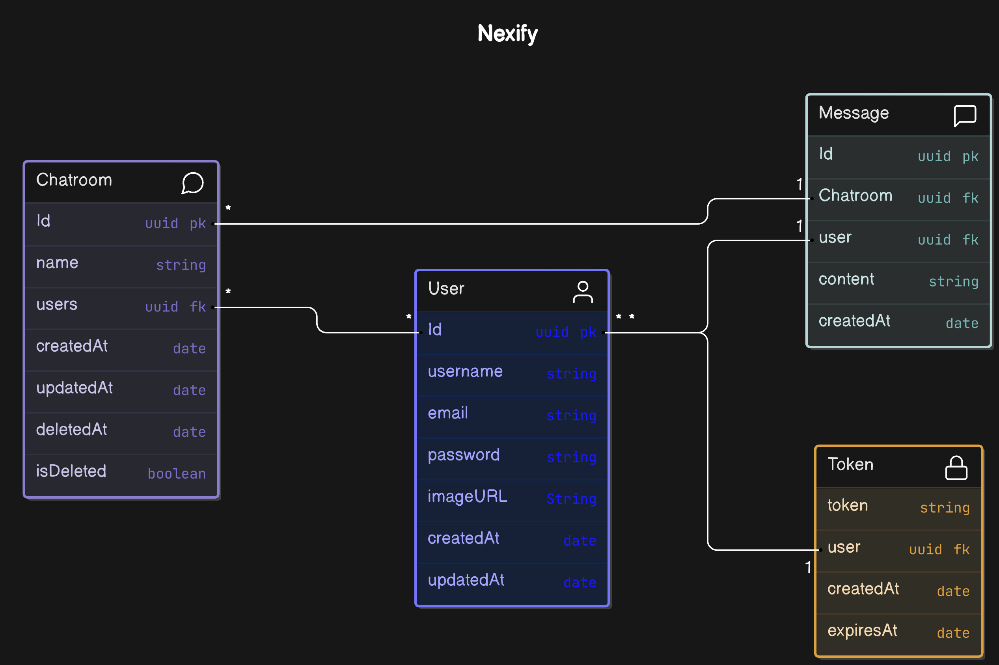

# Nexify - Backend
This is the backend of the Nexify project. It is a RESTful API that provides the necessary endpoints for the frontend to interact with the database.

## Project overview
Nexify is a real-time chat application that allows users to create profiles, chat with each other, form groups, and send chat invites. This repository contains the backend code for Nexify, built using Node.js, Express.js, and MongoDB.

## Features
- User authentication and authorization using JWT
- Real-time messaging with Socket.IO
- User and chat room management
- API documentation with Swagger

## Technologies
- Node.js
- Express.js
- MongoDB
- Mongoose
- Socket.IO
- JWT
- bcrypt.js
- express-validator
- Swagger

## Database design



## Design Pattern Architecture
- MVC Architecture (Model View Controller)

```
.
├── assets
├── config
│   └── mongodb.js
├── controllers
│   ├── auth.controllers.js
│   ├── chat.controllers.js
│   ├── message.controllers.js
│   └── user.controllers.js
├── docs
│   └── swagger.js
├── helpers
│   ├── bcrypt.helpers.js
│   ├── jwt.helpers.js
│   └── socket.helpers.js
├── middleware
│   ├── auth.middleware.js
│   └── validateFields.js
├── models
│   ├── chatroom.model.js
│   ├── message.model.js
│   ├── token.model.js
│   └── user.model.js
├── routes
│   ├── auth.routes.js
│   ├── chat.routes.js
│   ├── message.routes.js
│   └── user.routes.js
├── .env
├── server.js
├── package.json
└── README.md
```

## Installation
1. Clone the repository
2. Run `npm install` to install all dependencies
3. Create a `.env` file and add the following environment variables:
```
PORT=3000
JWT_SECRET=<your-jwt-secret>
MONGODB_URI=<your mongodb uri>
```
4. Run `npm start` to start the server
5. Visit `http://localhost:3000/api-docs` to view the Swagger documentation

## License
This project is licensed under the MIT License - see the [LICENSE](LICENSE) file for details.